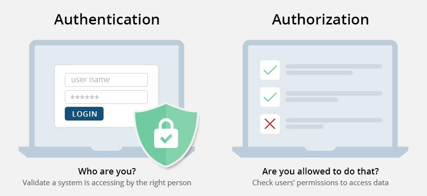
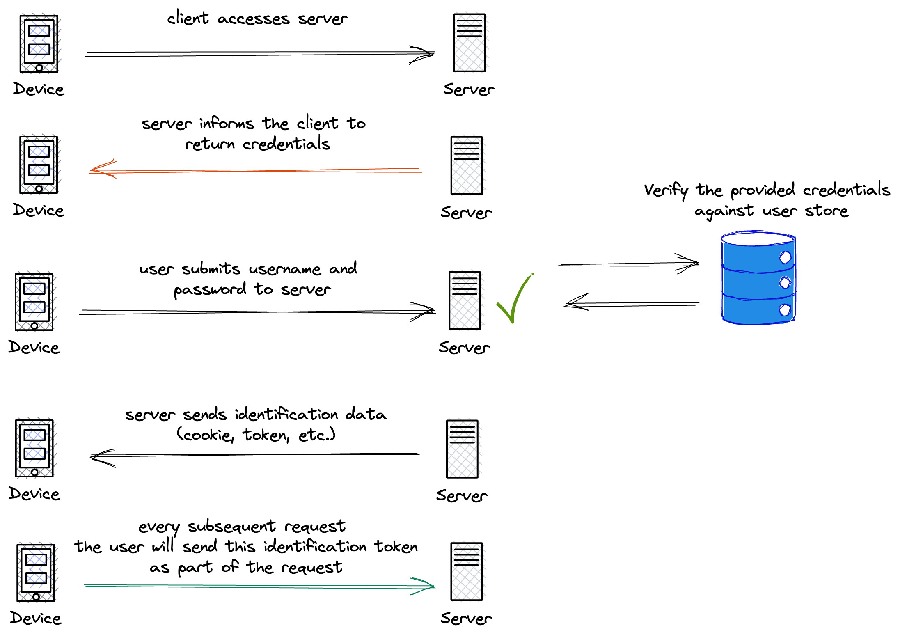
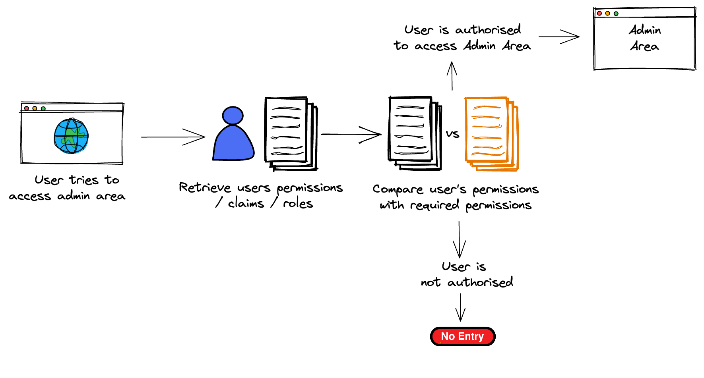

## **Authentication vs. Authorization: A Critical Analysis**

**Understanding the Concepts**

Authentication and Authorization are two fundamental security concepts often used interchangeably, but they serve distinct purposes. 
In simple terms it can be understood as:



* **Authentication:** This process verifies a user's claimed identity. It's like proving who you are by showing your passport at a border crossing.



* **Authorization:** This determines what actions a user is allowed to perform after being authenticated. It's like being granted a visa to enter a specific country.




**The Requirement: A Security Risk**

The requirement to allow users to delete any user account after authentication is a significant security flaw. While authentication ensures that only authorized users can access the system, it doesn't inherently grant them the permission to perform any action.

**Why is this a bad idea?**

* **Accidental Deletion:** Users might inadvertently delete their own or other users' accounts due to mistakes or misunderstandings.
* **Malicious Intent:** Users with malicious intent could exploit this vulnerability to delete accounts of their rivals or to cause disruption.
* **Data Loss:** Deleting accounts without proper authorization can lead to data loss and potential legal consequences.

**Implementing Proper Authorization**

To mitigate these risks, it's essential to implement proper authorization mechanisms. This typically involves:

1. **Role-Based Access Control (RBAC):** Assign roles to users (e.g., "admin", "user").
2. **Permission Assignment:** Define permissions associated with each role (e.g., "delete_user").
3. **Permission Checks:** Before allowing a user to perform an action, verify that their role has the necessary permission.

**Example:**

```javascript
async function delete_user_by_username(req, res) {
  // ... authentication code ...

  // Authorization check
  const loggedInUser = await get_user_id(req);
  if (loggedInUser.role !== "admin") {
    return res.status(403).json({ message: "You are not authorized to delete users" });
  }

  // ... rest of the code to delete the user ...
}
```

**Conclusion**

While authentication is essential for ensuring that only authorized users can access a system, it's equally important to implement robust authorization mechanisms to prevent unauthorized actions. By requiring users to have specific permissions before allowing them to delete accounts, we can significantly reduce the risk of accidental or malicious data loss.


## **Tutorial: Getting Started with Authentication and Authorization**

### **Prerequisites**

* Node.js and npm (or yarn) installed
* A basic understanding of Express.js and JavaScript

### **Installation**

1. **Clone the Repository:**
   ```bash
   git clone https://github.com/Amar5623/authentication-and-authorisation-with-expressjs.git
   ```
2. **Install Dependencies:**
   ```bash
   cd authentication-and-authorisation-with-expressjs
   cd back-end
   npm install bcryptjs body-parser cookie-parser cors dotenv express jsonwebtoken morgan sequelize sqlite3
   ```

### **Running the Application**

1. **Set Environment Variables:**
   Create a `.env` file within the back-end folder and add the following:
   ```
    TOKEN_KEY = "<Replace with your token key>";
    PORT = 4001;
   ```

2. **Start the Server:**
   ```bash
   cd back-end
   node app.js
   ```
3. **For frontend server**
    You can use Live server for this. Go to index.html and click Go Live. Then navigate to web-front-end/pages/. 

### **Using the Application**

1. **Register a New User:**
   * Fill in the required fields (username, password, email, contact number) and submit the form.

2. **Login:**
   * Enter your registered username and password.
   * Click the "Login" button.

3. **View User Profile:**
   * After successful login, you will be redirected to your user profile page.
   * You can view and update your profile information.

4. **Delete User:**
   * **Note:** The current implementation allows users to delete any account. This is a security vulnerability and should be addressed by implementing proper authorization checks as described in the README.

### **Additional Notes**

* The authentication mechanism in this project uses JSON Web Tokens (JWTs) for session management.
